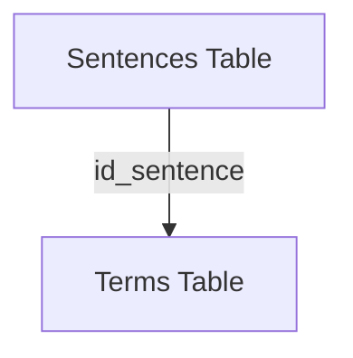

# SRD-ED
# Synthetic Data Generation for Relational Datasets using Euclidean Distance

## Overview
This project generates synthetic data for relational datasets using the concept of extended tables and Euclidean distance to connect related records. The synthetic data generation process is powered by the `synthpop` library, which creates synthetic data for individual extended tables.

## Features
- Utilizes **extended tables** to represent individual tables.
- Applies **Euclidean distance** to establish relationships between records.
- Uses **synthpop** to generate synthetic data for each extended table independently.
- Provides example implementations for the following datasets:
  - `Biodegradability_v1`
  - `CORA_v1`
  - `DCG_v1`
  - `imdb_MovieLens_v1`

## Dataset Structure
Each dataset folder contains the following subdirectories:
- `data/` - Contains the original dataset.
- `metadata/` - Stores metadata information for the dataset.
- `relationship/` - Defines the relationships between different tables.
- `synthetic_data/` - Contains the generated synthetic data.

The information about `data`, `metadata`, and `relationship` is sourced from datasets obtained via the **SDV library**.

## Requirements
- **Python 3.8**
- Dependencies specified in `requirements.txt`

## Installation
```bash
pip install -r requirements.txt
```

## Running the Code
Execute the main script to generate synthetic data:
```bash
python Synthethic_data.py
```

## Relationships in `DCG_v1`
The `DCG_v1` dataset consists of multiple tables linked through relational mappings. The relationships among these tables are established using Euclidean distance for connecting related records. The relationship details are stored in the `relationship/` folder for reference.

### Relationship Diagram



